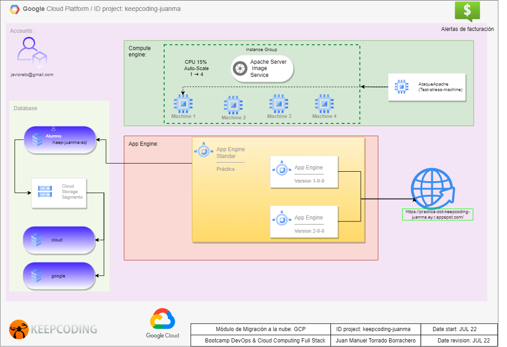

#  DevOps 

This project deploys services on the google cloud platform.

## Diagram

This is de diagram project

## Google App Engine

The next variables has been changed:
*    service: practica
   - CLOUDSQL_CONNECTION_NAME: keepcoding-juanma:europe-west3:keep-juanma-sql
   - CLOUDSQL_USER: alumno
   - CLOUDSQL_PASSWORD: googlecloud

## Stress Machine

Check Ip address before to start stress attack, It should take 60-80% CPU

## Terraform Bonus

Check the version of terraform and perform a **terraform init** to update resources libraries before to deployment

- variables.tf has been added in order to reuse code.
- .address is an output provided by ip google_compute_address source once static address is stablished

