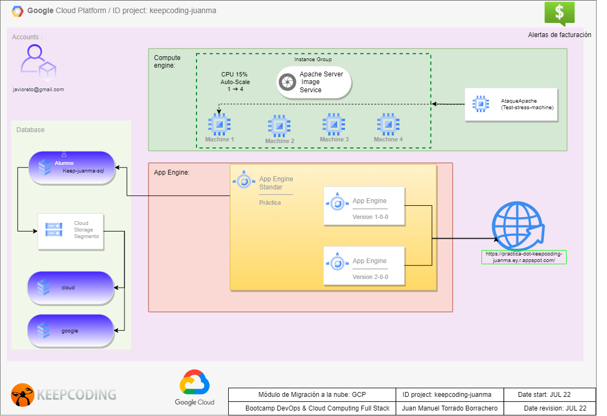

#  DevOps 

This project is a sample of some Google Cloud Platform services. AppEngine is implementing two different versions of a simple application that is powered by CloudSQL using three databases that can be managed by the "student" user. In the other hand you can see how a template of a Virtual Machine is deploying an auto-scale group using a health-cheack instead a Load Balanacer. In addition, a stress machine has been deployed using some scripts in order to test our auto-scale group.

As a bonus, I used Terraform to deploy some of theses reasources and also an management account.

## Diagram

This is de diagram project

## Google App Engine

The next variables has been changed:
*    service: practica
   - CLOUDSQL_CONNECTION_NAME: keepcoding-juanma:europe-west3:keep-juanma-sql
   - CLOUDSQL_USER: alumno
   - CLOUDSQL_PASSWORD: googlecloud

## Stress Machine

Check Ip address before to start stress attack, It should take 60-80% CPU

## Terraform Bonus

Check the version of terraform and perform a **terraform init** to update resources libraries before to deployment

- variables.tf has been added in order to re-use code.
- .address is an output provided by ip google_compute_address source once static address is stablished

